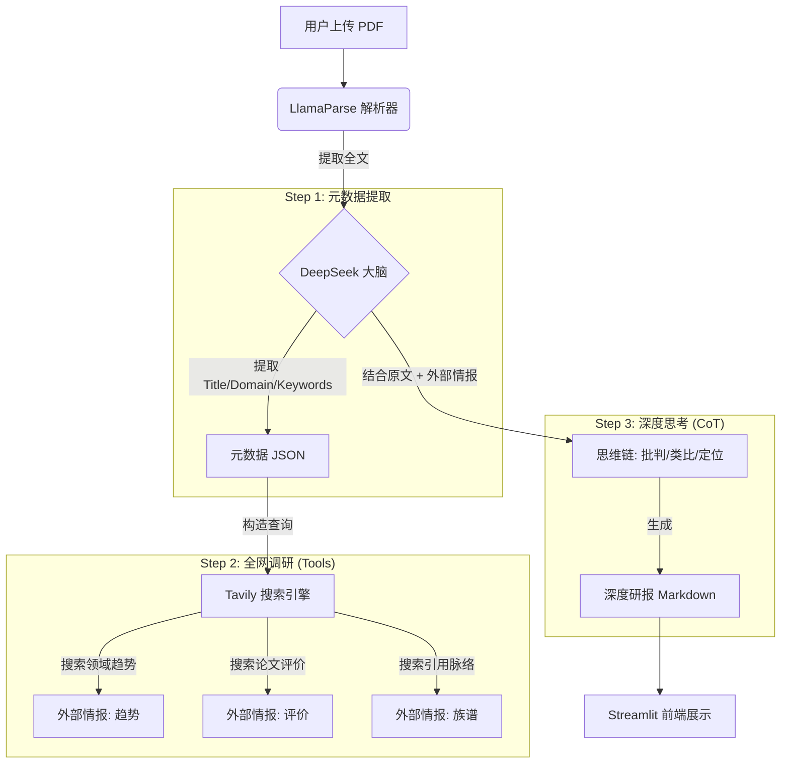

# 🎓 ScholarAgent: 智能论文深度研报生成器
"**Read Less, Understand More.**"
ScholarAgent 是一个基于 LLM 的科研辅助智能体。它不仅仅是总结摘要，更能通过 **Deep Reading (深度精读)** 和 **Deep Research (全网调研)**，为你生成一份包含学术脉络、领域热度、核心创新点及费曼式讲解的深度研报。

## 🌟 核心痛点与解决方案
作为科研人员，我们在阅读论文时常面临以下痛点：
1. **信息孤岛**：只看 PDF 无法了解该论文在领域内的真实地位（是 SOTA 还是灌水？）。
2. **理解门槛**：复杂的数学公式和术语难以快速消化。
3. **脉络缺失**：不知道这篇论文基于谁（Baselines），又被谁改进（Future Works）。


**ScholarAgent 的解决方案**：

- **全网调研 (Web Search)**：利用 Tavily API 实时搜索 GitHub 代码、社区评价和最新引用，打破信息孤岛。
- **费曼精读 (Feynman Technique)**：强制 AI 使用“通俗类比”和“生活案例”解释核心算法。
- **学术族谱 (Academic Lineage)**：专门梳理论文的“父亲”（前人工作）和“孩子”（后续研究），构建知识图谱。
## 🏗️ 技术架构


## 🛠️ 核心技术栈
- **PDF 解析**: LlamaParse (SOTA 级文档解析，支持复杂布局)
- **推理大脑**: DeepSeek-V3 (兼具高智商与高性价比)
- **联网工具**: Tavily (专为 AI 优化的搜索引擎)
- **前端界面**: Streamlit (快速构建数据应用)

## 🚀 快速开始
### 1. 克隆仓库
```bash
git clone [https://github.com/rgnp/ScholarAgent.git](https://github.com/rgnp/ScholarAgent.git)
cd ScholarAgent
```

### 2. 环境配置
```bash
# 创建虚拟环境
python -m venv .venv
source .venv/bin/activate  # Windows: .venv\Scripts\activate

# 安装依赖
pip install -r requirements.txt
```

### 3. 配置密钥
在根目录新建 .env 文件，填入你的 API Keys：
```bash
# 核心大模型
DEEPSEEK_API_KEY=sk-xxxxxx
DEEPSEEK_BASE_URL=[https://api.deepseek.com](https://api.deepseek.com)

# PDF 解析服务
LLAMA_CLOUD_API_KEY=llx-xxxxxx

# 联网搜索服务
TAVILY_API_KEY=tvly-xxxxxx
```

### 4. 启动应用
```bash
streamlit run src/app.py
```

### 📂 项目结构
```
ScholarAgent/
├── assets/             # 静态资源 (截图等)
├── src/
│   ├── app.py          # 前端主程序 (Streamlit)
│   ├── tools.py        # 工具箱 (封装 LlamaParse 和 Tavily)
│   └── researcher.py   # 核心逻辑 (Prompt Engineering & 流程编排)
├── .env                # 配置文件 (不要上传到 GitHub!)
├── .gitignore          # Git 忽略规则
├── requirements.txt    # 依赖列表
└── README.md           # 项目文档
```

### 📝 开发心得
在这个项目中，我重点探索了 `Prompt Engineering` 在复杂任务中的应用。通过设计结构化的 Super Prompt，我成功让 LLM 从“复读机”变成了具备批判性思维的“审稿人”。特别是在处理学术脉络分析时，结合联网搜索能显著减少大模型的幻觉问题。  
Created by [RGNP] - AI Engineering Journey.
